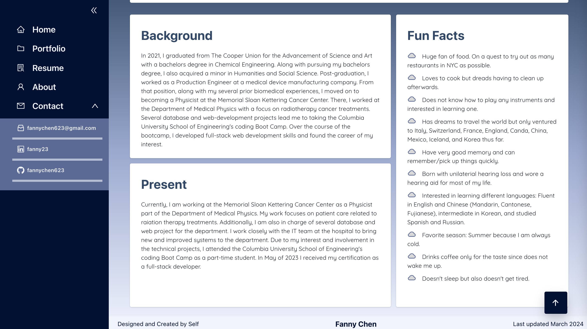
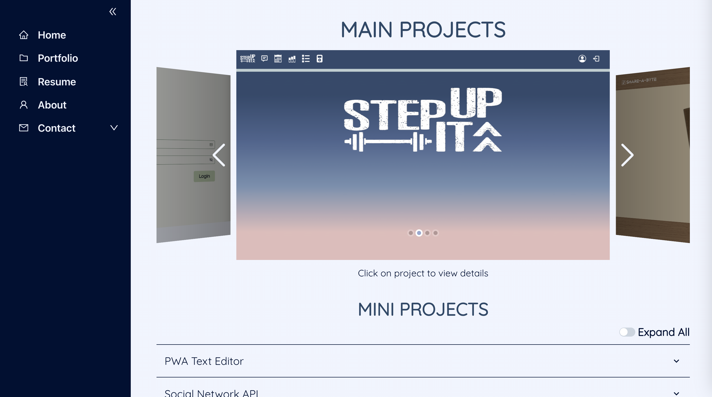
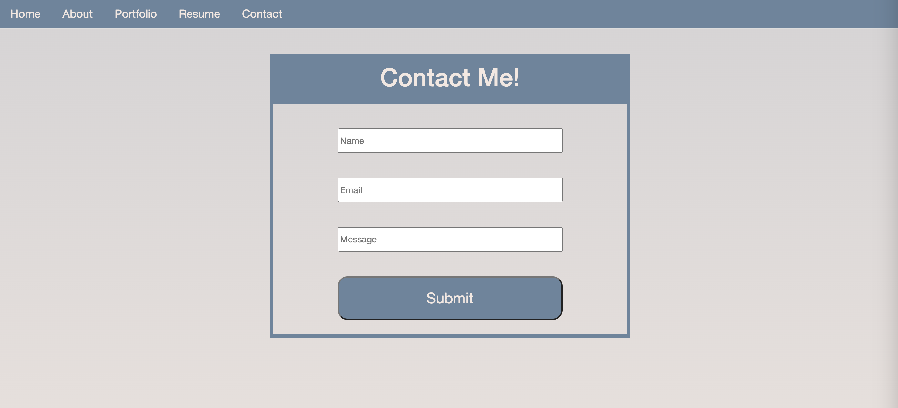

# Fanny Chen - Digital Portfolio

**Application Link:** [Fanny Chen](https://fannychen623.github.io/Fanny-Chen-Digital-Portfolio/)

**View:** [Table of Content](#table-of-content) / [Application Pages Preview](#application-pages-preview)

**Application Preview:**

---

## **TABLE OF CONTENT**

* [Descripton](#description)

* [Installation and Usage Instructions](#installation-and-usage-instructions)

* [App License](#app-license)

* [Contribution Guidelines](#contribution-guidelines)

* [Questions](#questions)

---

## Description

> This is my digital portfolio created using react and gh-pages.
> 
> Find information regarding my background, projects, and contact on the site.

---

## Installation and Usage Instructions 

> No installation required. 
> Access/view at - [Fanny Chen](https://fannychen623.github.io/Fanny-Chen-Digital-Portfolio/)

---

## App License 

> This app is not covered under a license.

---

## Contribution Guidelines 

> Application not accepting direct contribution.
> However, any feedback is welcomed to be sent via the contact page on the site.

---

## Questions 

> For more information and questions, please contact me below:
> * <fannychen623@gmail.com> [(GitHub)](https://github.com/fannychen623)

---

## **APPLICATION PAGES PREVIEW**
### Home Page
>
### About Page
>
### Portfolio Page
>
### Resume Page
>
### Contact Page
>
